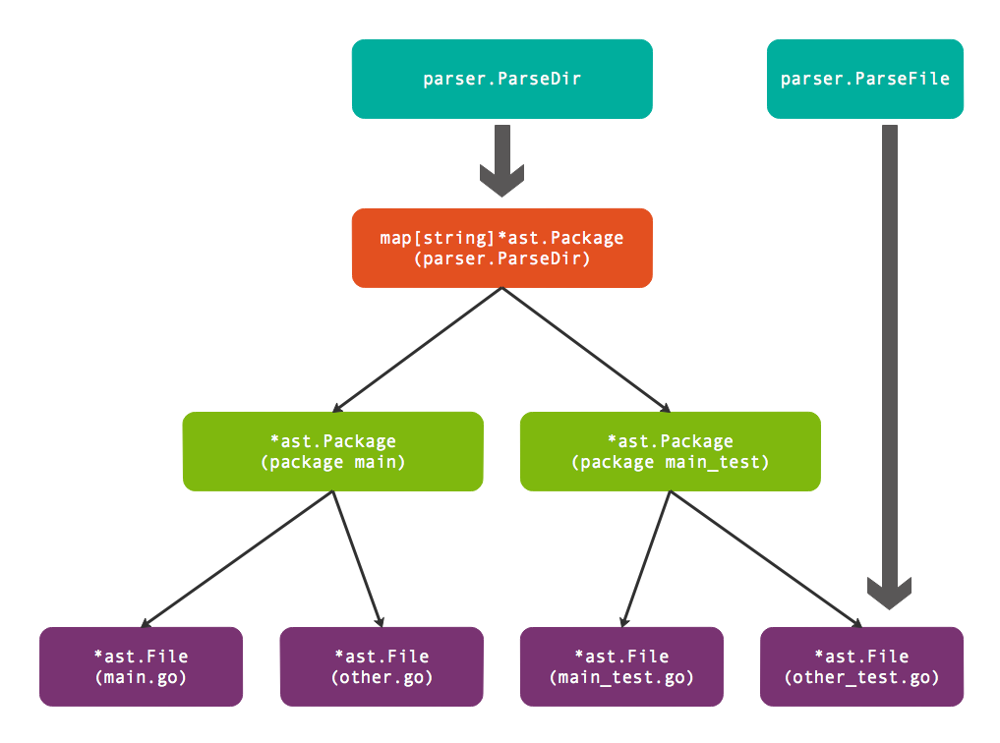
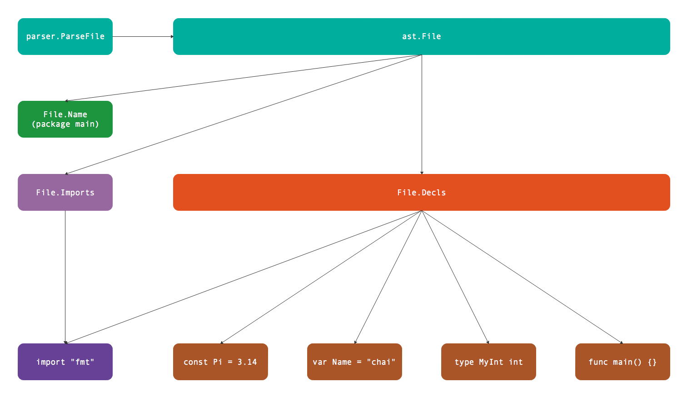

# 第4章 代码结构

前文我们以及简单了解如何解析单个表达式。但是Go语言的表达式不是独立存在的语法结构，如果我们希望通过表达式和赋值语句来更新上下文环境，那么就需要将表达式放到Go语言源文件环境进行解析。Go语言的代码结构主要分为三个层面：目录结构、目录内部的包结构、文件内部的代码结构。标准库的`go/parser`包只提供了目录和文件解析的函数，因此我们主要从这两个函数学习和语法树相关的代码结构。

## 4.1 目录结构

Go语言代码根据目录组织，一个包由多个文件组织，文件必须属于同一个目录下。不过包的单元测试虽然也和包的普通代码文件属于同一个目录，但是测试代码可以属于一个独立的测试包（独立的测试包名是以`_test`为后缀）。标准库`go/parser`包中的`parser.ParseDir`用于解析目录内的全部Go语言文件，返回的`map[string]*ast.Package`包含多个包信息。而`parser.ParseFile`用于解析单个文件，返回的`*ast.File`包含文件内部代码信息。而每个`*ast.Package`正是由多个`*ast.File`文件组成。它们直接的逻辑关系如下图所示：



图中展示的测试包由`main.go`、`other.go`、`main_test.go`、`other_test.go`四个文件组成，其中`main.go`、`other.go`两个文件属于`package main`包，而`main_test.go`、`other_test.go`两个文件属于`package main_test`测试包。因此`parser.ParseDir`解析出两个包，每个包中各有两个文件。当然，我们也可以针对每个文件手工调用`parser.ParseFile`函数进行解析，然后根据包的名字输出类似`parser.ParseDir`的结果。

因为`parser.ParseDir`的实际的代码实现也是由`parser.ParseFile`函数简单包装而来，因此我们只要简单了解目录结构即可，文件内部的代码结构才是Go语法树解析的难点和要点。

## 4.2 文件结构

Go语言是一个精心设计的语言，语法非常利于理解和解析。一个Go语言文件中，顶级的语法元素只有package、import、type、const、var和func这几种。每个文件的语法规范定义如下：

```
SourceFile    = PackageClause ";" { ImportDecl ";" } { TopLevelDecl ";" } .

PackageClause = "package" PackageName .
PackageName   = identifier .

TopLevelDecl  = Declaration | FunctionDecl | MethodDecl .
Declaration   = ConstDecl | TypeDecl | VarDecl .
```

SourceFile表示一个Go源文件，由PackageClause表示的包定义、ImportDecl表示的导入声明和TopLevelDecl表示顶级声明三个部分组成。其中TopLevelDecl又由通用声明、函数声明和方法声明组成，通用声明再分为常量、类型和变量声明。

以下代码是一个Go源文件的例子：

```go
package pkgname

import ("a", "b")
type SomeType int
const PI = 3.14
var Length = 1

func main() {}
```

只要通过每行开头的不同关键字就可以明确属于那种声明类型。使用`go/parser`包的`parser.ParseFile`函数就可以对上面的代码进行解析：

```go
func main() {
	fset := token.NewFileSet()
	f, err := parser.ParseFile(fset, "hello.go", src, parser.AllErrors)
	if err != nil {
		fmt.Println(err)
		return
	}

	...
}

const src = `package pkgname

import ("a"; "b")
type SomeType int
const PI = 3.14
var Length = 1

func main() {}
`
```

`parser.ParseFile`函数返回的是`*ast.File`类型的结构体：

```go
type File struct {
	Doc        *CommentGroup   // associated documentation; or nil
	Package    token.Pos       // position of "package" keyword
	Name       *Ident          // package name
	Decls      []Decl          // top-level declarations; or nil
	Scope      *Scope          // package scope (this file only)
	Imports    []*ImportSpec   // imports in this file
	Unresolved []*Ident        // unresolved identifiers in this file
	Comments   []*CommentGroup // list of all comments in the source file
}
```

结构体的`File.Name`成员表示文件对应包的名字，然后是`File.Imports`表示当前文件导入的第三方的包信息。因此通过以下代码就可以输出当前包名和导入包名字：

```go
	fmt.Println("package:", f.Name)

	for _, s := range f.Imports {
		fmt.Println("import:", s.Path.Value)
	}

	// Output:
	// package: pkgname
	// import: "a"
	// import: "b"
```

但是结构体中最重要的其实是`File.Decls`成员，它包含来当前文件全部的包级声明信息（包含导入信息）。即使没有`File.Imports`成员，我们也可以从`File.Decls`声明列表中获取全部导入包的信息。

通过以下的代码可以查看`File.Decls`每个成员的类型信息：

```go
	for _, decl := range f.Decls {
		fmt.Printf("decl: %T\n", decl)
	}

	// Output:
	// decl: *ast.GenDecl
	// decl: *ast.GenDecl
	// decl: *ast.GenDecl
	// decl: *ast.GenDecl
	// decl: *ast.FuncDecl
```

分析输出结构可以发现前四个都是`*ast.GenDecl`类型，只有最后一个是`*ast.FuncDecl`类型。因此可以推测，`import`、`type`、`const`和`type`都是对应`*ast.GenDecl`类型，只有函数是独立的`*ast.FuncDecl`类型。

因此我们也可以从`f.Decls`列表中获取导入包的信息：

```go
	for _, v := range f.Decls {
		if s, ok := v.(*ast.GenDecl); ok && s.Tok == token.IMPORT {
			for _, v := range s.Specs {
				fmt.Println("import:", v.(*ast.ImportSpec).Path.Value)
			}
		}
	}
```

在遍历`f.Decls`列表时，首先判断是否为`*ast.GenDecl`类型，如果是并且`s.Tok`是`token.IMPORT`类型则表示是导入的声明。这样我们就可以将`s.Specs`列表的每个元素作为`*ast.ImportSpec`类型进行输出。

下图是`ast.File`结构体对应的代码结构：


首先通过`parser.ParseFile`解析文件得到`*ast.File`类型的结构体。`*ast.File`结构体中Name包含来包名信息，Decls包含来全部的声明信息（声明分别对应`ast.GenDecl`和`ast.FuncDecl`两种类型），以及导入信息。

## 4.3 诊断语法树

`go/ast`包为语法树提供了`ast.Print`函数专门打印语法树：

```shell
$ go doc ast.Print
package ast // import "go/ast"

func Print(fset *token.FileSet, x interface{}) error
    Print prints x to standard output, skipping nil fields. Print(fset, x) is
    the same as Fprint(os.Stdout, fset, x, NotNilFilter).
```

这是学习和调试语法树最重要的函数，通过其输出我们可以对语法树有一个直观的印象，从而为进一步分析处理语法树奠定基础。从`ast.Print`函数文档可以看出，它是`ast.Fprint`函数的再次包装（类似`fmt.Print`和`fmt.Fprint`函数的关系），这样我们不仅仅可以定义输出的目标，还可以通过过滤函数来控制要输出的内容。

此外通过`ast.Walk`可以遍历真个语法树（和`filepath.Walk`遍历目录的思想类似）：

```go
type myNodeVisitor struct {}

func (p *myNodeVisitor) Visit(n ast.Node) (w ast.Visitor) {
	if x, ok := n.(*ast.Ident); ok {
		fmt.Println("myNodeVisitor.Visit:", x.Name)
	}
	return p
}

func main() {
	fset := token.NewFileSet()
	f, err := parser.ParseFile(fset, "hello.go", src, parser.AllErrors)
	if err != nil {
		log.Fatal(err)
		return
	}

	ast.Walk(new(myNodeVisitor), f)
}

const src = `...` // 和前面的内容相同
```

首先定义一个新的`myNodeVisitor`类型以满足`ast.Visitor`接口，然后在`myNodeVisitor.Visit`方法输出标识符类型的名字，最后通过`ast.Walk`遍历整个语法树。

输出结果如下：

```
myNodeVisitor.Visit: pkgname
myNodeVisitor.Visit: SomeType
myNodeVisitor.Visit: int
myNodeVisitor.Visit: PI
myNodeVisitor.Visit: Length
myNodeVisitor.Visit: main
```

当然，我们也可以通过`ast.Inspect`函数实现同样的功能：

```go
	ast.Inspect(f, func(n ast.Node) bool {
		if x, ok := n.(*ast.Ident); ok {
			fmt.Println("ast.Inspect", x.Name)
		}
		return true
	})
```

所以说，语法树的很多处理原理是相通的，`ast.Inspect`函数只是`ast.Walk`更简化版的包装而已。有了语法树之后，对import进行花样排序就变成了对`File.Decls`列表元素的处理问题。

## 4.5 总结

`parser.ParseDir`解析目录结构返回包含多个包的map，返回包的总体逻辑关系如下图所示：


多个包可以构成完整的可执行程序。每个包内部通过文件组织代码的导入和声明语句。而单个文件可以由`parser.ParseFile`完成解析，文件内部的逻辑关系如下图：



首先是包的名字，然后是导入的依赖包列表，最后是类型、常量、变量和函数等声明列表。而文件内部的声明列表是最复杂也是最重要的部分，其更详细的逻辑结构如下图：


声明部分包含基础声明和函数声明。基础声明包含导入声明、类型声明、常量声明和变量声明，它们都独立声明也可以按组方式声明，其中常量和变量的声明采用相同的结构表示。而函数声明不支持按组方式声明，函数声明主要包含接受者、函数参数和返回值组成的函数类型，以及函数的代码实现等信息。

